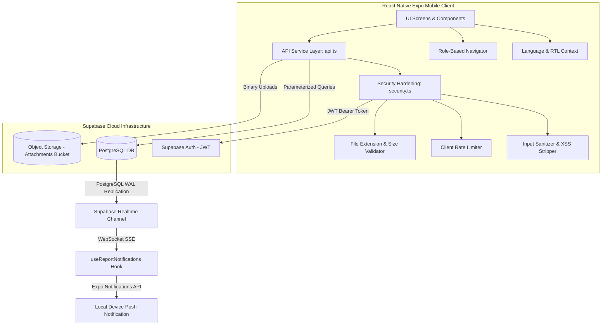

# 🇩🇿 الجزائر الحضرية — Algérie Urbaine
## Comprehensive Technical Specification & Functional Manual
### Plateforme de Signalement Urbain / منصة الإبلاغ عن المشاكل الحضرية
**République Algérienne Démocratique et Populaire**
**الجمهورية الجزائرية الديمقراطية الشعبية**

---

## 🏛️ 1. Executive Summary & Product Vision

**Algérie Urbaine** (انشغالاتي / Incheghalati) is a production-grade, highly secure, bilingual (Arabic & French) mobile platform engineered for municipal administrations and citizens across all 58 Wilayas of Algeria. Its core objective is to bridge the gap between citizens and public utility services. 

The application offers two distinct, role-based workflows:
1. **Citizen Flow**: Enables users to document urban anomalies (e.g., damaged roads, water leaks, public lighting failures, illegal waste disposal) with geotagged media, track report progress through a formal 5-stage timeline, and receive push notifications on updates.
2. **Team Leader (Maintenance) Flow**: Empowers municipal technical team leaders to view, update, and manage tasks assigned to them, record field investigations, and upload multi-image proof of resolution.

Designed with a high-trust, official government visual identity, the app implements strict security standards to protect government servers and public data from injection, spoofing, and rate abuse.

---

## 🏗️ 2. Architectural Blueprint

The application follows a decoupled client-server architecture. The frontend is built on **React Native (Expo SDK 54)** using TypeScript, communicating securely over HTTPS with a **Supabase** backend (built on PostgreSQL, Go-based Auth, and Object Storage).



### 2.1 Component Flow Patterns
- **Citizen Submission**: Citizen snaps photo $\rightarrow$ Location captured $\rightarrow$ Input sanitized $\rightarrow$ Query executed to create report record $\rightarrow$ Media binary uploaded to bucket partition $\rightarrow$ Attachment record linked.
- **Team Leader Execution**: Task assigned $\rightarrow$ Status updated to "In Progress" (triggers timestamp) $\rightarrow$ Repair completed $\rightarrow$ Multi-image evidence validated and uploaded $\rightarrow$ DB updated with array of completion URLs $\rightarrow$ Status moved to "Completed" $\rightarrow$ Notification pushed to citizen.

---

## 📁 3. Workspace Directory Structure

The project code is organized logically, enforcing strict separation of concerns, visual design modularity, and explicit security boundaries.

```
urban-issue-app/
├── App.tsx                          # Root Entry: Configures Paper, Safe Area, Localization, Navigation
├── theme.ts                         # Custom design system: Colors, typography, spacing, Paper overrides
├── app.json                         # Expo Application Config: Permissions, package configurations, assets
├── package.json                     # Node dependencies, version tags, build scripts
├── tsconfig.json                    # TypeScript compiler parameters
│
├── i18n/
│   └── strings.ts                   # Bilingual UI lexicon (180+ entries) & localization utility helpers
│
├── hooks/
│   ├── useAuth.ts                   # Listens to Supabase Auth state, parses JWT metadata
│   ├── useLanguage.tsx              # Language Context: Persists preferences and controls RTL managers
│   └── useReportNotifications.ts    # Configures push tokens, binds real-time PostgreSQL listeners
│
├── services/
│   ├── supabaseConfig.ts            # Bootstraps the Supabase Client with environment variables
│   ├── api.ts                       # Database CRUD operations and binary storage uploads
│   └── security.ts                  # Parameterized validation, rate limiting, sanitization controls
│
├── components/
│   ├── GovHeader.tsx                # Institutional top bar with SVG Zellij vector overlays
│   ├── ReportCard.tsx               # Feed card featuring spring scaling and dynamic Arabic date calculations
│   ├── StatusBadge.tsx              # Localized status indicators mapped to the national color scheme
│   ├── PriorityBadge.tsx            # Priority indicator showing severity dots
│   ├── EmptyState.tsx               # Styled vector layouts for offline or empty views
│   ├── LanguageToggle.tsx           # Bilingual switch pill (AR ⇄ FR)
│   └── SkeletonCard.tsx             # Shimmer effect layout for content loading states
│
├── screens/
│   ├── LoginScreen.tsx              # Secure entrance with institutional styling
│   ├── RegisterScreen.tsx           # New account registration with input checking
│   ├── HomeScreen.tsx               # Citizen main board displaying stats lists and creation buttons
│   ├── ReportScreen.tsx             # Geotagging, multi-input report builder
│   ├── ReportDetailsScreen.tsx      # Chronological progress tracking visualizer
│   ├── ProfileScreen.tsx            # Settings panel with offline toggle and caching options
│   ├── TeamLeaderHomeScreen.tsx     # Categorized tasks panel with filter tabs
│   ├── TeamLeaderReportDetailsScreen.tsx # Management screen for starting and completing tasks
│   └── TeamLeaderCompletionUploadScreen.tsx # Multi-photo proof of work uploader
│
├── types/
│   └── database.ts                  # Autogenerated Supabase DB TypeScript models
│
└── assets/                          # Static branding, flag graphics, sound FX
```

---

## 🔒 4. Security & Threat Mitigation Framework (`security.ts`)

A central pillar of the application is client-side security hardening. The file `services/security.ts` serves as a gateway to sanitize and block malicious payloads before they ever hit the database or storage servers.

### 4.1 Input Sanitization & Threat Vectors

#### XSS and SQL Injection Defense (`sanitizeText`)
Strips out standard HTML script-tags, inline style event hooks (`onload`, `onclick`), and database instruction strings to block XSS execution and raw SQL manipulation.

```typescript
export const sanitizeText = (input: string): string => {
  if (!input || typeof input !== 'string') return '';

  return input
    // Remove HTML tags
    .replace(/<[^>]*>/g, '')
    // Remove script-related event handlers & javascript protocols
    .replace(/javascript:/gi, '')
    .replace(/on\w+\s*=/gi, '')
    // Block SQL instruction words by stripping them out when combined with punctuation
    .replace(/(['";])\s*(DROP|DELETE|UPDATE|INSERT|ALTER|EXEC|UNION|SELECT)\s/gi, '$1')
    // Remove null bytes which are often used to bypass validation
    .replace(/\0/g, '')
    // Compress duplicate whitespaces
    .replace(/\s+/g, ' ')
    .trim();
};
```

#### Email Verification (`sanitizeEmail`)
Enforces syntax rules based on the RFC 5322 specification, truncates length to prevent buffer overloads, and normalizes capitalization.

```typescript
export const sanitizeEmail = (email: string): string => {
  if (!email || typeof email !== 'string') throw new Error('Email is required');
  const sanitized = email.trim().toLowerCase();
  
  const emailRegex = /^[a-zA-Z0-9.!#$%&'*+/=?^_`{|}~-]+@[a-zA-Z0-9](?:[a-zA-Z0-9-]{0,61}[a-zA-Z0-9])?(?:\.[a-zA-Z0-9](?:[a-zA-Z0-9-]{0,61}[a-zA-Z0-9])?)*$/;
  if (!emailRegex.test(sanitized)) throw new Error('Invalid email format');
  if (sanitized.length > 254) throw new Error('Email too long');

  return sanitized;
};
```

### 4.2 Strict Input Validation Constraints
- **Title Range Checks**: Titles are sanitized and validated to confirm they fall within the range of $[3, 200]$ characters.
- **Description Range Checks**: Descriptions must satisfy the length constraint: $10 \le \text{length} \le 2000$.
- **Severity Boundaries**: Priority integers are strictly validated to verify they fall within the range of $[1, 4]$.
- **GPS Coordinates Range Checks**: Captures must reflect valid global mapping bounds:
  $$\text{Latitude} \in [-90^\circ, 90^\circ] \quad \text{and} \quad \text{Longitude} \in [-180^\circ, 180^\circ]$$
- **State Progression Verification**: Only predefined, logical status values are allowed:
  $$\text{Status} \in \{\text{'pending'}, \text{'assigned'}, \text{'in\_progress'}, \text{'completed'}, \text{'approved'}, 0, 1, 2, 3, 4\}$$

### 4.3 Media Hardening & Path Traversal Mitigations

#### Directory Traversal Defense (`sanitizeFileName`)
Path components like `/`, `\`, and `..` are stripped from uploaded files. This ensures that filenames remain flat and safe, preventing them from overwriting system files during storage operations.

```typescript
export const sanitizeFileName = (fileName: string): string => {
  return fileName
    .replace(/[/\\]/g, '') // Strip slash structures
    .replace(/\0/g, '') // Strip null injections
    .replace(/[^a-zA-Z0-9._-]/g, '_') // Replace symbols with underscores
    .replace(/\.{2,}/g, '.'); // Prevent double extensions
};
```

#### Media Type and Size Verification
Only modern, secure image types are allowed. Uploads are strictly limited to **10MB** to protect system storage and bandwidth.
- **Allowed Formats**: `jpg`, `jpeg`, `png`, `webp`, `heic`, `heif`

### 4.4 Client-Side Rate Limiting
To protect system resources, a sliding-window rate limiter runs locally on the device. It keeps track of timestamps in-memory to prevent spamming actions like report submissions and media uploads.

```typescript
const actionTimestamps: Map<string, number[]> = new Map();

export const checkRateLimit = (
  action: string,
  maxAttempts: number,
  windowMs: number
): { allowed: boolean; retryAfterMs?: number } => {
  const now = Date.now();
  const timestamps = actionTimestamps.get(action) || [];

  // Filter timestamps within the current window
  const recent = timestamps.filter(t => now - t < windowMs);

  if (recent.length >= maxAttempts) {
    const oldestInWindow = recent[0];
    const retryAfterMs = windowMs - (now - oldestInWindow);
    return { allowed: false, retryAfterMs };
  }

  recent.push(now);
  actionTimestamps.set(action, recent);
  return { allowed: true };
};
```

### 4.5 Session-Based Access Controls
- **User Authentication Enforcer (`requireAuth`)**: Verifies that a valid JWT session exists with Supabase, retrieving the user profile directly from the server to prevent token spoofing.
- **Role Verification (`requireRole`)**: Checks the authenticated user's JWT metadata to ensure their current role (`citizen` or `team_leader`) matches the requirements for the requested action.

---

## 🗄️ 5. Database Schema & RLS Policies

Data is stored in a relational PostgreSQL database. Access is protected by Row Level Security (RLS) policies, ensuring that users can only read and write data according to their roles and permissions.

```
  ┌────────────────────────────────────────────────────────┐
  │                        reports                         │
  ├────────────────────────────────────────────────────────┤
  │ [PK] id : uuid (Gen_Random_UUID())                     │
  │      created_at : timestamptz                          │
  │      title : text                                      │
  │      description : text                                │
  │      priority : integer (1, 2, 3, 4)                   │
  │      status : integer (0, 1, 2, 3, 4)                  │
  │      is_resolved : boolean                             │
  │ [FK] reporter_id : uuid ──────────> [auth.users.id]     │
  │      location : jsonb {lat, lng}                       │
  │ [FK] team_leader : uuid ──────────> [auth.users.id]     │
  │      assigned_to_at : timestamptz                      │
  │      under_investigation_at : timestamptz              │
  │      work_in_progress_at : timestamptz                 │
  │      completion_images : text[]                        │
  │      resolved_at : timestamptz                         │
  │      approved_at : timestamptz                         │
  └───────────────────────────┬────────────────────────────┘
                              │ 1
                              │
                              │ 0..N
  ┌───────────────────────────▼────────────────────────────┐
  │                      attachments                       │
  ├────────────────────────────────────────────────────────┤
  │ [PK] id : serial                                       │
  │ [FK] issue_id : uuid ──────────────────────────────────┘
  │      file_url : text
  │      name : text
  │      uploaded_at : timestamptz
  └────────────────────────────────────────────────────────┘
```

### 5.1 Tables Definition (SQL DDL)

```sql
-- Enforce UUID generation and automatic timestamps
CREATE TABLE public.reports (
    id UUID PRIMARY KEY DEFAULT gen_random_uuid(),
    created_at TIMESTAMPTZ DEFAULT timezone('utc'::text, now()) NOT NULL,
    title TEXT NOT NULL,
    description TEXT NOT NULL,
    priority INTEGER DEFAULT 2 NOT NULL,
    status INTEGER DEFAULT 0 NOT NULL,
    is_resolved BOOLEAN DEFAULT false NOT NULL,
    reporter_id UUID REFERENCES auth.users(id) ON DELETE CASCADE NOT NULL,
    location JSONB NOT NULL,
    team_leader UUID REFERENCES auth.users(id) ON DELETE SET NULL,
    assigned_to_at TIMESTAMPTZ,
    under_investigation_at TIMESTAMPTZ,
    work_in_progress_at TIMESTAMPTZ,
    completion_images TEXT[] DEFAULT '{}'::TEXT[],
    resolved_at TIMESTAMPTZ,
    approved_at TIMESTAMPTZ
);

CREATE TABLE public.attachments (
    id SERIAL PRIMARY KEY,
    issue_id UUID REFERENCES public.reports(id) ON DELETE CASCADE NOT NULL,
    file_url TEXT NOT NULL,
    name TEXT NOT NULL,
    uploaded_at TIMESTAMPTZ DEFAULT timezone('utc'::text, now()) NOT NULL
);
```

### 5.2 Row Level Security (RLS) SQL Declarations
Security policies are enforced directly at the database level. This ensures that even if client-side validation is bypassed, users can only access records they are explicitly authorized to view or edit.

```sql
-- Enable Row Level Security
ALTER TABLE public.reports ENABLE ROW LEVEL SECURITY;
ALTER TABLE public.attachments ENABLE ROW LEVEL SECURITY;

-- 1. CITIZEN POLICIES
-- Citizens can view their own reports
CREATE POLICY "Citizens can view own reports" 
ON public.reports FOR SELECT 
TO authenticated 
USING (auth.uid() = reporter_id);

-- Citizens can create reports with their own ID
CREATE POLICY "Citizens can insert own reports" 
ON public.reports FOR INSERT 
TO authenticated 
WITH CHECK (auth.uid() = reporter_id);

-- 2. TEAM LEADER POLICIES
-- Team leaders can view reports assigned to them
CREATE POLICY "Team Leaders can view assigned reports" 
ON public.reports FOR SELECT 
TO authenticated 
USING (auth.uid() = team_leader);

-- Team leaders can update reports assigned to them
CREATE POLICY "Team Leaders can update assigned reports" 
ON public.reports FOR UPDATE 
TO authenticated 
USING (auth.uid() = team_leader)
WITH CHECK (auth.uid() = team_leader);

-- 3. ATTACHMENT ASSOCIATED ACCESS
CREATE POLICY "Users can insert attachments linked to their reports" 
ON public.attachments FOR INSERT 
TO authenticated 
WITH CHECK (
    EXISTS (
        SELECT 1 FROM public.reports 
        WHERE id = attachments.issue_id 
        AND (reporter_id = auth.uid() OR team_leader = auth.uid())
    )
);

CREATE POLICY "Users can select attachments linked to their reports" 
ON public.attachments FOR SELECT 
TO authenticated 
USING (
    EXISTS (
        SELECT 1 FROM public.reports 
        WHERE id = attachments.issue_id 
        AND (reporter_id = auth.uid() OR team_leader = auth.uid())
    )
);
```

---

## 🎨 6. Institutional Design System & UI/UX Styling (`theme.ts`)

The visual design is styled after an official Algerian government service, blending traditional geometric elements with a clean, high-contrast Material 3 theme.

### 6.1 Unified Color Palette

| Color Key | Hex Code | Visual Role |
| :--- | :--- | :--- |
| **`republicGreen`** | `#006233` | Primary identity color (headers, FAB, active controls) |
| **`activeGreen`** | `#00A651` | Soft gradient tones and focus highlights |
| **`surfaceGreen`** | `#E8F5E9` | Light green backgrounds for success cards |
| **`governmentGold`** | `#D4AF37` | Authority accents and role badges |
| **`goldLight`** | `#FFF8DC` | Background highlights for administrative items |
| **`offWhite`** | `#F5F5F0` | Default application background |
| **`cardWhite`** | `#FFFFFF` | Card background color |
| **`deepNavy`** | `#1A1A2E` | High-contrast title text |
| **`textSecondary`**| `#5A6072` | Secondary body text |
| **`textMuted`** | `#9BA3B8` | Subdued captions and timestamps |
| **`borderLight`** | `#E2E8F0` | High-contrast dividers |

### 6.2 Status & Priority Colors

#### Status Codes & Labels

- **Pending** (معلق / En attente): `#F57F17` (Amber)
- **Assigned** (مُسنَد / Assigné): `#1565C0` (Blue)
- **In Progress** (قيد التنفيذ / En cours): `#6A1B9A` (Purple)
- **Completed** (مكتمل / Terminé): `#2E7D32` (Green)
- **Approved** (مُعتمَد / Approuvé): `#006233` (Republic Green)

#### Priority Values

- **1 (Low)** (منخفض): `#388E3C` (Green)
- **2 (Medium)** (متوسط): `#F57F17` (Amber)
- **3 (High)** (عالي): `#C62828` (Crimson)
- **4 (Emergency)** (مستعجل): `#D32F2F` (Deep Red)

### 6.3 Typography Scale
- **Fonts**: **Noto Naskh Arabic** (Arabic fallback) and **Inter** (Latin typography fallback).
- **Scale Configurations**:
  - `heading1`: `fontSize: 28`, `fontWeight: '700'`, `letterSpacing: -0.5`
  - `heading2`: `fontSize: 22`, `fontWeight: '600'`
  - `heading3`: `fontSize: 18`, `fontWeight: '600'`
  - `body`: `fontSize: 16`, `lineHeight: 26`
  - `caption`: `fontSize: 13`, `lineHeight: 20`
  - `label`: `fontSize: 12`, `fontWeight: '500'`, `letterSpacing: 0.4`

### 6.4 Spacing & Border Metrics
- **Spacing Grid**: $8\text{pt}$ base system: $\text{xs} (4)$, $\text{sm} (8)$, $\text{md} (16)$, $\text{lg} (24)$, $\text{xl} (32)$, $\text{xxl} (48)$ pixels.
- **Roundness Values**:
  - `card`: $16\text{pt}$
  - `button`: $12\text{pt}$
  - `badge`: $8\text{pt}$
  - `input`: $10\text{pt}$

### 6.5 Lighting & Elevation Shadows
- **Card Shadows**: `shadowColor: '#000'`, `shadowOffset: { width: 0, height: 2 }`, `shadowOpacity: 0.06`, `shadowRadius: 8`, `elevation: 3`.
- **Eminent Widgets (FAB)**: `shadowColor: '#006233'`, `shadowOffset: { width: 0, height: 8 }`, `shadowOpacity: 0.3`, `shadowRadius: 16`, `elevation: 8`.

---

## 🌍 7. Bilingual Localization Framework

The application features full, seamless localization for both Arabic and French. It supports Right-to-Left (RTL) layout mirroring and localized date and number systems.

```
                  ┌─────────────────────────────┐
                  │      LanguageProvider       │
                  └──────────────┬──────────────┘
                                 │
                   Reads saved 'app_lang' preference
                 from AsyncStorage (defaults to 'ar')
                                 │
                                 ▼
         If 'ar' (RTL) ────────────────────── If 'fr' (LTR)
         ┌─────────────┐                      ┌─────────────┐
         │ Force RTL   │                      │ Disable RTL │
         └──────┬──────┘                      └──────┬──────┘
                │                                    │
                ├────────────────────────────────────┘
                ▼
        Triggers application reload via Expo Updates if state changes
                │
                ▼
      Exports: { lang, isRTL, t, toArabicNumeral }
```

### 7.1 Translation Context (`useLanguage.tsx`)
The `LanguageProvider` handles language changes, updates system settings, and persists the user's preference to the device's storage.

```typescript
export const LanguageProvider: React.FC<{ children: React.ReactNode }> = ({ children }) => {
  const [lang, setLangState] = useState<Language>('ar');
  const [isRTL, setIsRTL] = useState(true);

  useEffect(() => {
    // Load persisted configuration on startup
    const loadLang = async () => {
      const saved = await AsyncStorage.getItem('app_lang');
      if (saved === 'fr') {
        setLangState('fr');
        setIsRTL(false);
      } else {
        setLangState('ar');
        setIsRTL(true);
      }
    };
    loadLang();
  }, []);

  const setLanguage = async (newLang: Language) => {
    await AsyncStorage.setItem('app_lang', newLang);
    const shouldBeRTL = newLang === 'ar';
    
    setLangState(newLang);
    setIsRTL(shouldBeRTL);
    I18nManager.forceRTL(shouldBeRTL);
    
    // Restart Expo application to rebuild layout directions
    Updates.reloadAsync();
  };

  return (
    <LanguageContext.Provider value={{ lang, isRTL, setLanguage, t: (key) => t(key, lang) }}>
      {children}
    </LanguageContext.Provider>
  );
};
```

### 7.2 Core Bilingual Utilities

#### Dynamic Number Conversion (`toArabicNumeral`)
Automatically formats Western digits ($0-9$) to Eastern Arabic numerals ($٠-٩$) when the language is set to Arabic.
$$\text{Western: } 12345 \quad \xrightarrow{\text{ar conversion}} \quad \text{Arabic: } ١٢٣٤٥$$

```typescript
export const toArabicNumeral = (n: number | string, lang: string): string => {
  const str = String(n);
  if (lang !== 'ar') return str;
  const arabicDigits = ['٠', '١', '٢', '٣', '٤', '٥', '٦', '٧', '٨', '٩'];
  return str.replace(/[0-9]/g, (d) => arabicDigits[parseInt(d, 10)]);
};
```

---

## ⚡ 8. Core API & Database Operations (`api.ts`)

The service layer in `services/api.ts` handles all database interactions. Each function is secured by checking authorization on the server and sanitizing input parameters.

### 8.1 Submit Citizen Report (`submitReport`)
Saves a new citizen report to the database, processes related image uploads, and updates the attachments bucket.
- **Access Level**: Authenticated Citizen (`role` null or standard)
- **Rate Limit**: 5 submissions per minute
- **Security Check**: Verifies that the authenticated user's ID matches the `reporter_id` to prevent user spoofing.

```typescript
export const submitReport = async (data: ReportData): Promise<string> => {
  const user = await requireAuth();

  // 1. Check Rate Limit
  const rateLimit = checkRateLimit('submitReport', 5, 60000);
  if (!rateLimit.allowed) {
    throw new Error(`Submit rate exceeded. Cooldown active.`);
  }

  // 2. Sanitize and Validate Form Fields
  const cleanTitle = sanitizeText(data.title);
  const cleanDesc = sanitizeText(data.description);
  
  if (!validateTitle(cleanTitle).valid || !validateDescription(cleanDesc).valid) {
    throw new Error('Input validation failed.');
  }
  
  if (data.userId !== user.id) {
    throw new Error('Impersonation blocked. IDs do not match.');
  }

  // 3. Create Report Record
  const { data: record, error: dbError } = await supabase
    .from('reports')
    .insert({
      title: cleanTitle,
      description: cleanDesc,
      priority: data.priority || 2,
      status: 0,
      reporter_id: user.id,
      location: JSON.stringify(data.location),
    })
    .select().single();

  if (dbError) throw new Error(dbError.message);

  // 4. Validate and Upload Image
  if (data.imageUri) {
    const fileExtCheck = validateFileExtension(data.imageUri);
    if (!fileExtCheck.valid) throw new Error(fileExtCheck.error);

    const fileInstance = new File(data.imageUri);
    const fileBuffer = await fileInstance.arrayBuffer();

    if (!validateFileSize(fileBuffer.byteLength).valid) {
      throw new Error('File exceeds maximum size limit.');
    }

    const secureName = sanitizeFileName(`issue_${Date.now()}.${fileExtCheck.extension}`);
    const storagePath = `report-${record.id}/${secureName}`;

    const { error: uploadError } = await supabase.storage
      .from('Attachments')
      .upload(storagePath, fileBuffer, {
        contentType: `image/${fileExtCheck.extension}`,
        upsert: false,
      });

    if (uploadError) throw new Error(uploadError.message);

    // Save attachment record in PostgreSQL
    await supabase.from('attachments').insert({
      issue_id: record.id,
      file_url: storagePath,
      name: secureName,
    });
  }

  return record.id;
};
```

### 8.2 Get User Reports (`getUserReports`)
Retrieves all reports created by the logged-in citizen, ordered by date.
- **Access Level**: Authenticated Citizen
- **Security Check**: Enforces a strict filter to fetch only records where `reporter_id` matches the user's ID. It also converts private storage paths into public URLs.

```typescript
export const getUserReports = async (): Promise<ReportWithAttachments[]> => {
  const user = await requireAuth();

  const { data, error } = await supabase
    .from('reports')
    .select('*, attachments (*)')
    .eq('reporter_id', user.id)
    .order('created_at', { ascending: false });

  if (error) return [];

  // Generate public URLs for all attachments
  return data.map((report) => ({
    ...report,
    attachments: report.attachments.map((att: any) => ({
      ...att,
      file_url: supabase.storage.from('Attachments').getPublicUrl(att.file_url).data.publicUrl,
    })),
  })) as ReportWithAttachments[];
};
```

### 8.3 Get Team Leader Assigned Tasks (`getTeamLeaderReports`)
Fetches all tasks assigned to the current team leader.
- **Access Level**: Authenticated Team Leader (`role === 'team_leader'`)
- **Security Check**: Validates the user's role and fetches only records where `team_leader` matches the logged-in user.

```typescript
export const getTeamLeaderReports = async (): Promise<ReportWithAttachments[]> => {
  const user = await requireAuth();
  if (user.user_metadata?.role !== 'team_leader') {
    throw new Error('Access denied. Team Leader role required.');
  }

  const { data, error } = await supabase
    .from('reports')
    .select('*, attachments (*)')
    .eq('team_leader', user.id)
    .order('created_at', { ascending: false });

  if (error) return [];

  return data.map((report) => ({
    ...report,
    attachments: report.attachments.map((att: any) => ({
      ...att,
      file_url: supabase.storage.from('Attachments').getPublicUrl(att.file_url).data.publicUrl,
    })),
  })) as ReportWithAttachments[];
};
```

### 8.4 Update Task Status (`updateReportStatus`)
Updates the status of a report, adding timestamps automatically as it moves through the workflow.
- **Access Level**: Assigned Team Leader
- **Security Check**: Verifies that the task exists, and that the logged-in team leader is the one assigned to it.

```typescript
export const updateReportStatus = async (reportId: string, status: string | number) => {
  const user = await requireAuth();
  if (!validateUUID(reportId)) throw new Error('Invalid ID format.');
  if (!validateStatus(status)) throw new Error('Invalid status.');

  const { data: task } = await supabase
    .from('reports')
    .select('*')
    .eq('id', reportId)
    .single();

  if (!task) throw new Error('Task not found.');

  // Auto-assign to current team leader if unassigned
  const updates: any = {};
  if (!task.team_leader || task.team_leader !== user.id) {
    updates.team_leader = user.id;
    updates.assigned_to_at = new Date().toISOString();
  }

  // Set updates based on the status transition
  if (status === 'completed' || status === 3) {
    updates.status = 3;
    updates.is_resolved = true;
    updates.resolved_at = new Date().toISOString();
  } else if (status === 'in_progress' || status === 2) {
    updates.status = 2;
    updates.work_in_progress_at = new Date().toISOString();
  }

  await supabase.from('reports').update(updates).eq('id', reportId);
};
```

### 8.5 Upload Completion Evidence (`uploadCompletionImages`)
Uploads photo proof of the completed work, adds optional notes, and marks the report as completed.
- **Access Level**: Assigned Team Leader
- **Rate Limit**: 3 submissions per minute
- **Security Check**: Limits uploads to a maximum of 6 images, verifies image formats, and confirms the team leader's assignment to the task.

```typescript
export const uploadCompletionImages = async (reportId: string, imageUris: string[]): Promise<string[]> => {
  const user = await requireAuth();
  if (!validateUUID(reportId)) throw new Error('Invalid ID.');
  if (imageUris.length > 6) throw new Error('Maximum 6 proof images allowed.');

  const limitCheck = checkRateLimit('uploadCompletion', 3, 60000);
  if (!limitCheck.allowed) throw new Error('Upload limit exceeded. Please wait.');

  const { data: task } = await supabase
    .from('reports')
    .select('team_leader')
    .eq('id', reportId)
    .single();

  if (task.team_leader !== user.id) throw new Error('Unauthorized.');

  const uploadedUrls: string[] = [];

  for (let i = 0; i < imageUris.length; i++) {
    const uri = imageUris[i];
    const extensionInfo = validateFileExtension(uri);
    if (!extensionInfo.valid) throw new Error(extensionInfo.error);

    const file = new File(uri);
    const buffer = await file.arrayBuffer();

    const secureName = sanitizeFileName(`resolved_${Date.now()}_${i}.${extensionInfo.extension}`);
    const storagePath = `report-${reportId}/${secureName}`;

    await supabase.storage.from('Attachments').upload(storagePath, buffer, {
      contentType: `image/${extensionInfo.extension}`,
      upsert: false,
    });

    const publicUrl = supabase.storage.from('Attachments').getPublicUrl(storagePath).data.publicUrl;
    uploadedUrls.push(publicUrl);
  }

  // Update report in database with the proof image URLs
  await supabase
    .from('reports')
    .update({
      completion_images: uploadedUrls,
      status: 3,
      is_resolved: true,
      resolved_at: new Date().toISOString(),
    })
    .eq('id', reportId);

  return uploadedUrls;
};
```

---

## 🧭 9. Routing & Navigation Architecture

The app uses **React Navigation** to manage the navigation flow. The navigation structure dynamically changes depending on the user's role, ensuring that users can only access screens relevant to them.

```
                                 ┌─────────────────────────┐
                                 │      AppNavigator       │
                                 └────────────┬────────────┘
                                              │
                                     Session Active?
                                              │
                            ┌─────────────────┴─────────────────┐
                           Yes                                 No
                            │                                   │
                     Role Assessment                            ▼
                            │                            ┌─────────────┐
                ┌───────────┴───────────┐                │ Auth Stack  │
                │                       │                ├─────────────┤
          citizen                  team_leader           │ • Login     │
                │                       │                │ • Register  │
                ▼                       ▼                └─────────────┘
         ┌─────────────┐         ┌─────────────┐
         │ Tab Stack   │         │ Tab Stack   │
         ├─────────────┤         ├─────────────┤
         │ • Home      │         │ • Tasks     │
         │ • NewReport │         │ • Profile   │
         │ • Profile   │         └──────┬──────┘
         └──────┬──────┘                │
                │                       ▼
                ▼                ┌─────────────┐
         ┌─────────────┐         │ Stack View  │
         │ Stack View  │         ├─────────────┤
         ├─────────────┤         │ • Details   │
         │ • Details   │         │ • Upload    │
         └─────────────┘         └─────────────┘
```

- **Authentication Stack**: Unauthenticated users are directed to the login or registration screens.
- **Citizen Bottom Tab Navigator**: Authenticated citizens get access to their dashboard, the report submission form, and their profile.
- **Team Leader Tab Navigator**: Team leaders are directed to a specialized dashboard showing their assigned tasks, along with their profile settings.

---

## 🎨 10. Custom UI Components

### 10.1 Government Header (`GovHeader.tsx`)
An elegant header that features a beautiful gradient and a traditional Zellij geometric pattern overlaid on top, fitting the app's official identity.

```tsx
export const GovHeader: React.FC<GovHeaderProps> = ({ title, subtitle, showBack, onBack, badge }) => {
  const { isRTL } = useLanguage();
  const insets = useSafeAreaInsets();

  return (
    <LinearGradient
      colors={[colors.republicGreen, colors.activeGreen]}
      style={[styles.container, { paddingTop: insets.top + spacing.sm }]}
    >
      {/* Zellij Vector SVG Overlay */}
      <Svg style={StyleSheet.absoluteFill}>
        <Defs>
          <Pattern id="zellij" width="40" height="40" patternUnits="userSpaceOnUse">
            <Path d="M0 20 L20 0 L40 20 L20 40 Z" stroke="#FFF" strokeWidth="0.5" fill="none" opacity="0.07" />
          </Pattern>
        </Defs>
        <Rect width="100%" height="100%" fill="url(#zellij)" />
      </Svg>

      <View style={[styles.row, isRTL && styles.rowRTL]}>
        {showBack && (
          <TouchableOpacity onPress={onBack} style={styles.backBtn}>
            <MaterialCommunityIcons name={isRTL ? 'chevron-right' : 'chevron-left'} size={28} color="#FFF" />
          </TouchableOpacity>
        )}
        <View style={styles.titleArea}>
          <Text style={styles.title}>{title}</Text>
          {subtitle && <Text style={styles.subtitle}>{subtitle}</Text>}
        </View>
        {badge && <View style={styles.badge}><Text>{badge}</Text></View>}
      </View>
    </LinearGradient>
  );
};
```

### 10.2 Social-Feed Report Card (`ReportCard.tsx`)
A polished card used to display reports, designed with smooth spring animations on press and layout mirroring for RTL support.
- **Spring Feedback**: Uses React Native's `Animated.spring` to scale down the card slightly when pressed ($1.0 \rightarrow 0.98$), providing clear visual feedback.
- **Localized Time Ago**: Displays the time since submission in either Arabic or French, ensuring accurate translation of relative time values.

---

## 📱 11. Screen-by-Screen Functional Logic

### 11.1 Authentication Screens
- **LoginScreen**: Features the national colors, input fields with validation, an easy language selector, and validation for secure logins.
- **RegisterScreen**: Includes inputs for full name, email, and password, using validation rules to ensure strong passwords and matching password confirmations.

### 11.2 Citizen Workspace
- **HomeScreen (Feed)**: Displays citizen submission metrics (total, pending, and resolved counts). Shows a list of the user's reports with pull-to-refresh and a shimmer loading effect. Clicking the Floating Action Button (FAB) opens the report submission form.
- **ReportScreen (Submission)**: A step-by-step form to create reports. Captures location automatically, handles camera/gallery uploads, sanitizes title and description text, and assigns priority levels.
- **ReportDetailsScreen**: Features a hero image, Google Maps navigation link, and an interactive 5-stage timeline showing report progress from submission to administrative approval.

```
       [Pending] ────> [Assigned] ────> [In Progress] ────> [Completed] ────> [Approved]
       (Submitted)      (Allocated)       (On-Site Repair)    (Evidence Uploaded) (Final Sign-off)
```

### 11.3 Team Leader Workspace
- **TeamLeaderHomeScreen**: The main dashboard showing tasks filterable by their current stage (All, Pending, or In Progress), complete with task count badges.
- **TeamLeaderReportDetailsScreen**: Provides actions to update tasks, such as starting work (updates status to "In Progress") and accessing the evidence uploader screen.
- **TeamLeaderCompletionUploadScreen**: A grid supporting up to 6 completion photos, allowing team leaders to upload visual proof along with their closure notes.

---

## 🔔 12. Real-Time Synchronization & Local Notifications

The application uses a real-time listener to instantly capture changes in the database and push updates to the user's device.

### 12.1 Real-Time Listener Setup (`useReportNotifications.ts`)
Subscribes to PostgreSQL database updates through WebSockets, listening for status changes on reports matching the user's ID.

```typescript
export const useReportNotifications = () => {
  const { user } = useAuth();
  const { lang } = useLanguage();

  useEffect(() => {
    if (!user) return;

    // Listen for updates on the reports table
    const realtimeChannel = supabase
      .channel('citizen_reports_channel')
      .on(
        'postgres_changes',
        {
          event: 'UPDATE',
          schema: 'public',
          table: 'reports',
          filter: `reporter_id=eq.${user.id}`, // Filter for this user's reports
        },
        (payload) => {
          const oldStatus = payload.old?.status;
          const newStatus = payload.new?.status;

          // Trigger a local notification if the status changes
          if (newStatus && oldStatus !== newStatus) {
            const reportName = payload.new?.title || 'Report';
            
            const notifTitle = lang === 'ar' ? 'تحديث حالة البلاغ!' : 'Mise à jour du signalement!';
            const notifBody = lang === 'ar'
              ? `تم تغيير حالة بلاغك "${reportName}" إلى مكتمل.`
              : `Le statut de votre signalement "${reportName}" a été mis à jour.`;

            Notifications.scheduleNotificationAsync({
              content: {
                title: notifTitle,
                body: notifBody,
                sound: 'notification.mp3',
                priority: Notifications.AndroidNotificationPriority.MAX,
              },
              trigger: null, // Deliver immediately
            });
          }
        }
      )
      .subscribe();

    return () => {
      supabase.removeChannel(realtimeChannel);
    };
  }, [user, lang]);
};
```

---

## 🛠️ 13. System Maintenance & Diagnostic Procedures

### 13.1 Production Release Pipeline
To compile the release binaries on Windows without issues from path-length limitations, use a virtual folder junction:

```powershell
# Create folder junction
New-Item -ItemType Junction -Path "C:\urbanbuild" -Value "C:\Users\ilyes\Desktop\urbain app report\urban-issue-app"

# Build Android release binary from the junction folder
cd C:\urbanbuild\android
.\gradlew assembleRelease
```

### 13.2 Troubleshooting Common Issues
- **Image Upload Failures**: Ensure that RLS policies allow inserts on the `attachments` table, and confirm that the storage bucket named `Attachments` is set to public.
- **RTL Layout Flipping**: Changing languages forces an application reload using `Updates.reloadAsync()`. This guarantees that React Native applies the correct layout direction (`I18nManager.forceRTL`) immediately.
- **Missing Push Notifications**: Ensure permissions are granted on the device. For Android, verify that a notification channel named `default` is correctly configured with max importance.
